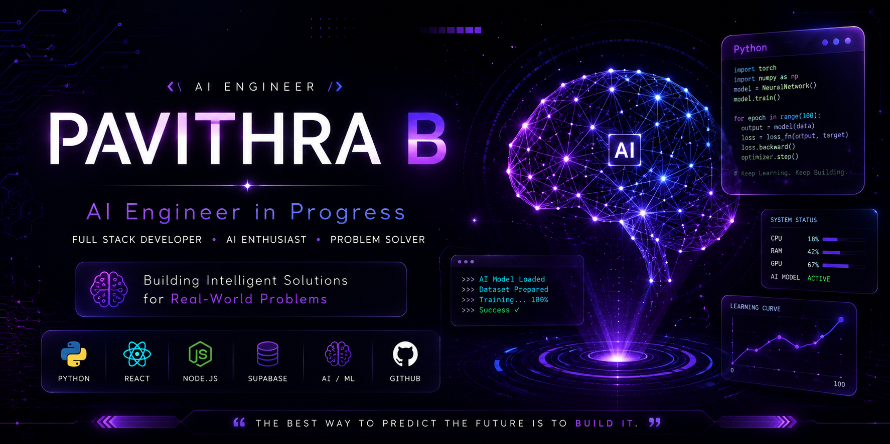
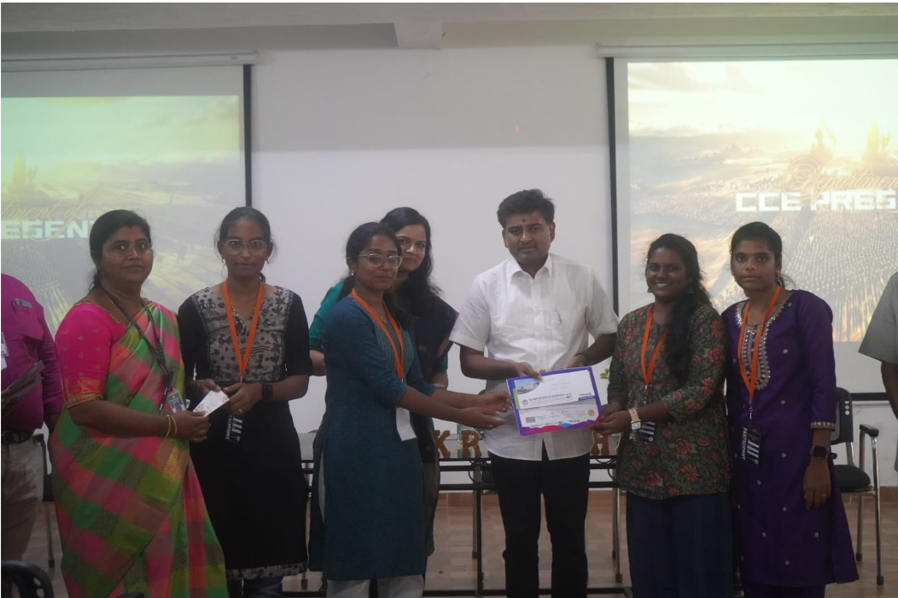
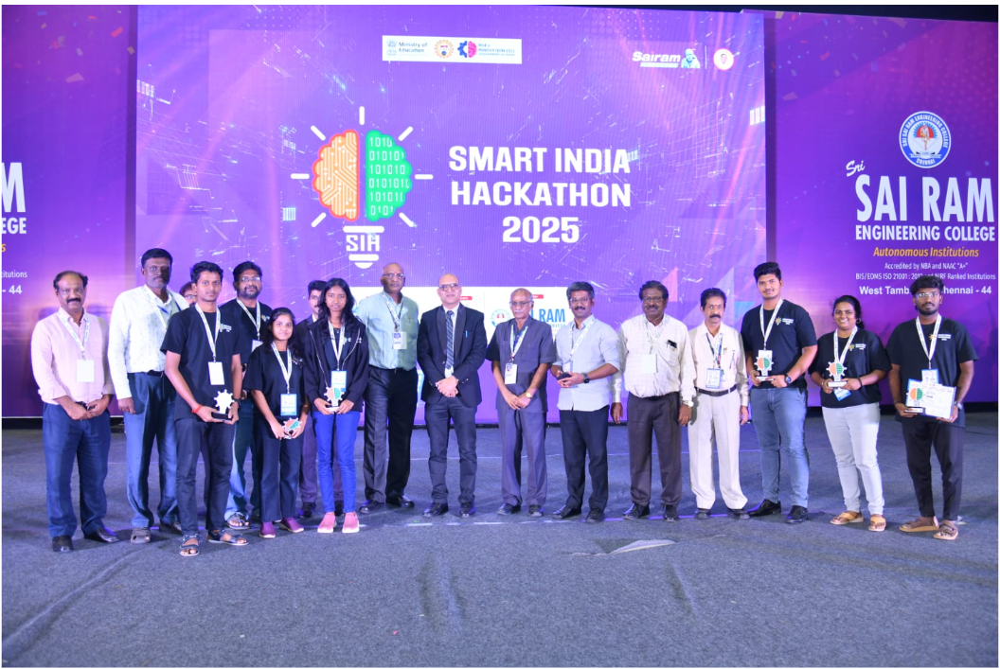

# 👋 Hi, I'm Pavithra B

### 🚀 AI Engineer in Progress | Full Stack Developer | Problem Solver

---

---

# 🧠 About Me

🎓 Third Year Computer Science Engineering Student

🤖 Passionate about Artificial Intelligence & Machine Learning

💻 Building AI-powered Applications

🌐 Full Stack Developer

🏆 Hackathon Winner

🌱 Currently Learning Deep Learning, LLMs & AI Agents

🎯 Goal: Become an AI Engineer at a Top Product Company

---

# ⚡ Tech Universe

### 💻 Languages

**Python • Java • JavaScript • C**

### 🌐 Frontend

**HTML • CSS • React • Tailwind CSS**

### ⚙ Backend

**Node.js • Express.js**

### 🗄 Database

**MySQL • MongoDB • Supabase**

### 🎨 Tools

**Git • GitHub • VS Code • Figma**

---

# 🚀 Featured Projects

| 🚀 Project | Description |
|------------|-------------|
| 🦺 **Smart PPE Detection System** | AI-powered worker safety monitoring using YOLO & React |
| 💳 **Financial Fraud Detection** | Machine Learning based fraud detection |
| 🛡 **Cybersecurity Threat Detection** | Network threat monitoring system |
| 🤖 **Personal AI Assistant** | AI Companion with Memory *(In Progress)* |

---

# 🏆 Achievement Gallery

| 🥇 Chakravyuha 1.0 | 🥈 IBM Hackathon |
|:------------------:|:----------------:|
|  |  |
| **1st Prize Winner** | **Runner-up** |

 

### 🚀 Smart India Hackathon

**AI-based Smart PPE Compliance Monitoring System**

---

# 📜 Certifications

- 📘 IBM Python 101
- 🔐 Cybersecurity Bootcamp
- 🎓 RUSA Employability Skills

---

# 📊 GitHub Analytics

  

---

# 🌱 Currently Learning

---

# 🎯 2026 Goals

- 🚀 Build 30+ AI Projects
- ⭐ Contribute to Open Source
- 💼 Join Google / Microsoft
- 🌍 Launch an AI Product
- 🤖 Become an AI Engineer

---

# 💭 Quote

### 💜 "Building Intelligent Solutions for Real-World Problems."

---

# 🤝 Connect With Me

---

## ⭐ Thanks for Visiting My Profile

### 🚀 Building AI • Learning Every Day • Creating Impact

