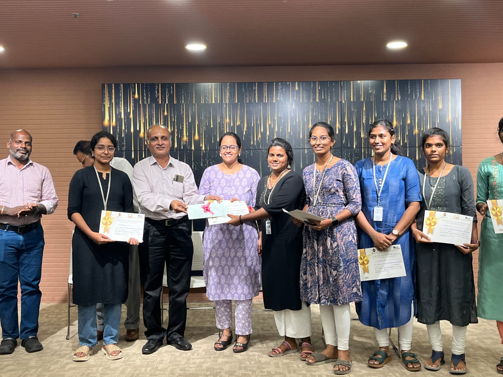

# 👋 Hi, I'm Pavithra B

### 🚀 AI Engineer in Progress | Full Stack Developer | Problem Solver

 

🎓 **University College of Engineering Kancheepuram (UCEK)** • **2023 – 2027**

📊 **CGPA:** **8.73**

 

---

---

# 👨‍💻 Who Am I?

<table>
<tr>

<td width="60%">

### 👋 Hello!

I'm **Pavithra B**, a Computer Science Engineering student with a strong passion for **Artificial Intelligence, Machine Learning, and Full Stack Development**.

I enjoy transforming ideas into intelligent applications that solve real-world problems.

🏆 Hackathon Winner

🤖 AI Enthusiast

💻 Full Stack Developer

🚀 Future AI Engineer

I believe continuous learning and consistent building are the keys to becoming a great engineer.

</td>

<td align="center">

</td>

</tr>
</table>

---

# ⚡ Current Focus

| 🤖 AI | 💻 Development | 📚 Learning |
|:---:|:---:|:---:|
| Machine Learning | React.js | Deep Learning |
| Computer Vision | Node.js | AI Agents |
| YOLO | Full Stack | LLMs |
| Prompt Engineering | Supabase | System Design |

---

# 🛠️ Tech Universe

## 💻 Languages

**Python • Java • JavaScript • C**

 

## 🌐 Frontend

**HTML • CSS • React • Tailwind CSS**

 

## ⚙️ Backend

**Node.js • Express.js**

 

## 🗄️ Database

**MySQL • MongoDB • Supabase**

 

## 🤖 AI / ML

**Machine Learning • OpenCV • YOLO • Prompt Engineering**

 

## 🎨 Tools

**Git • GitHub • VS Code • Figma**

---

# 🚀 Featured Projects

<table>

<tr>

<td width="50%">

## 🦺 Smart PPE Detection System

AI-powered worker safety monitoring using Computer Vision.

### ⚙️ Tech Stack

Python • YOLO • React • Supabase

</td>

<td width="50%">

## 💳 Financial Fraud Detection

Machine Learning model to detect fraudulent transactions.

### ⚙️ Tech Stack

Python • Machine Learning • SQL

</td>

</tr>

<tr>

<td width="50%">

## 🛡️ Cybersecurity Threat Detection

Security monitoring and threat detection application.

### ⚙️ Tech Stack

Python • Networking • Cybersecurity

</td>

<td width="50%">

## 🤖 Personal AI Assistant

An AI companion with memory, voice interaction, and intelligent conversations.

### 🚧 Status

Currently Building

</td>

</tr>

</table>

---
# 🏆 Achievement Gallery

<table>

<tr>

<td align="center">

### 🥇 Chakravyuha 1.0

**🏆 First Prize Winner**

</td>

<td align="center">

### 🥈 IBM Naan Mudhalvan Hackathon

**🏅 Runner-up**

</td>

</tr>

</table>

 

### 🚀 Smart India Hackathon

**AI-Based Smart PPE Compliance Monitoring System**

---

# 📜 Certifications

| 🎓 Certification | Status |
|:----------------:|:------:|
| IBM Python 101 | ✅ Completed |
| Cybersecurity Bootcamp | ✅ Completed |
| RUSA Employability Skills | ✅ Completed |

---

# 📊 GitHub Analytics

  

 

---

# 🌱 Currently Learning

---

# 🎯 Goals for 2026

- 🚀 Build **30+ AI Projects**
- 🤝 Become an **Open Source Contributor**
- 💼 Secure a role at a **Top Product Company**
- 🌍 Launch an **AI Product**
- 🤖 Become a Professional **AI Engineer**

---

# 💬 Inspiration

> **"The best way to predict the future is to invent it."**

### — Alan Kay

---

# 🤝 Connect With Me

---

 

### ⭐ Thanks for Visiting My Profile ⭐

#### 💜 *Building AI • Solving Problems • Creating Impact*

➡️ **End of Part 1**
